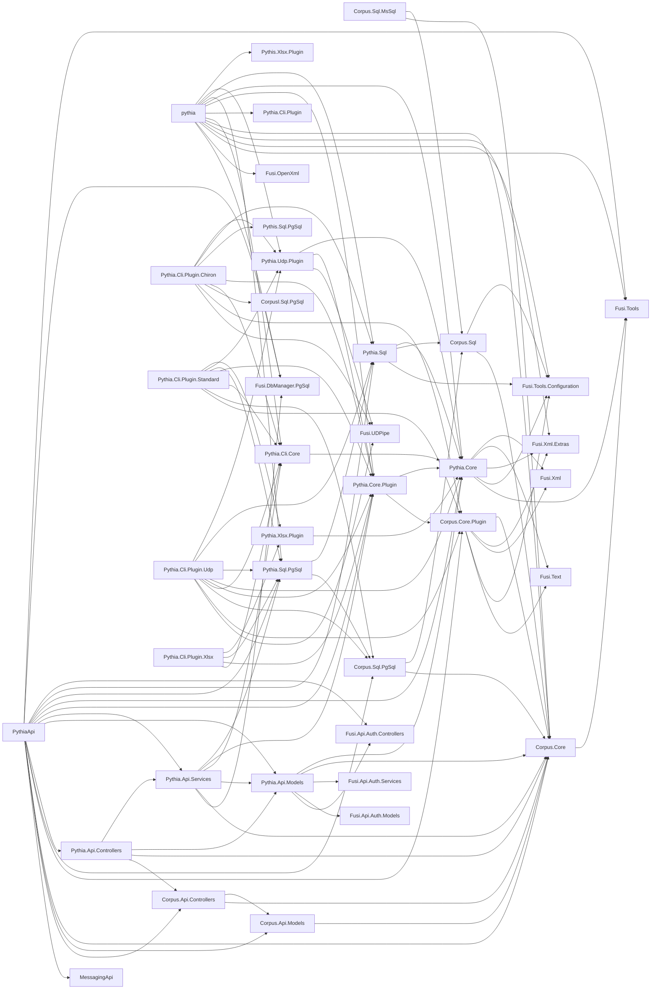

# Pythia

- [Pythia](#pythia)
  - [Docker](#docker)
  - [Projects](#projects)
  - [Quick Start](#quick-start)
    - [Prerequisites](#prerequisites)
    - [Procedure](#procedure)
    - [API](#api)
  - [ANTLR](#antlr)
    - [Generating Code](#generating-code)

Pythia simple concordance search engine. For a general introduction see D. Fusi, _Text Searching Beyond the Text: a Case Study_, «Rationes Rerum» 15 (2020) 199-230. The implementation of the system here is more advanced, and query syntax was changed, but the approach is the same.

Please note that this system is work in progress. It is being refactored from an the older prototype, by progressively adding code and refining it.

📖 [Documentation](https://vedph.github.io/pythia-doc/)

Main features:

- _full stack architecture_, from database to business layer to web API and web frontend, all deployed in a Docker compose stack.

- _concordances-based_: designed from the ground up with concordances in mind: word locations here are not an afterthought or an additional payload attached to an existing location-less engine. The whole [architecture](./doc/model.md) is based on positions in documents, and these positions may also refer to other text structures besides words. In this higher abstraction level, a text is somewhat "dematerialized" into a set of token-based _positions_ linked to an open set of _metadata_. Rather than a long sequence of characters, a text is viewed as an abstract set of entities, each having any metadata, in most cases also including their position in the original text. These entities may represent documents, groups of documents (corpora), and words and any other textual structure (e.g. a verse, a strophe, a sentence, a phrase, etc.), with no limits, even when multiple structures overlap. Searching for a verse or a sentence, or whatever other textual structure is equal to searching for a word; and we can freely mix and combine these different entity types in a query.

- _minimal dependencies_: simple implementation with widely used standard technologies: the engine relies on a RDBMS, and is wrapped in a REST API. The only dependency is the database service. The index is just a standard RDBMS, so that you can easily integrate it into your own project. You might even bypass the search engine, and directly query or otherwise manipulate it via SQL.

- _flexible, modular and open_: designed to be totally configurable via external parameters: you decide every relevant aspect of the indexing pipeline (filtering, tokenization, etc.), and can use any kind of input format (e.g. plain text, TEI, etc.) and source (e.g. file system, BLOB storage, web resources etc.).

- [UDPipe plugins](docs/udp.md) to incorporate any subset of POS tagging data into the index.

## Docker

🐋 Quick Docker image build:

```bash
docker build . -t vedph2020/pythia-api:5.0.5 -t vedph2020/pythia-api:latest
```

(replace with the current version).

To **restore a database** when the container starts (so that you can play with a prebuilt index) you have two options:

- [restoring database from Docker compose](https://stackoverflow.com/questions/70879120/how-to-restore-postgresql-in-docker-compose)
- restore a database from a set of PostgreSQL binary files generated via bulk table copy (e.g. `COPY table TO STDOUT (FORMAT BINARY);`), have your dump files (one for each table in the database) in some folder in your host machine (e.g. `/opt/dump`), connect this folder to the container API via a volume, and set the corresponding environment variable (`DATA_SOURCEDIR`) to that volume. In this case, the API will seed data from the dump files on startup when creating the database. Example:

```yml
  pythia-api:
    # ...
    environment:
        # ...
        - DATA__SOURCEDIR=/opt/dump/
    volumes:
        - /opt/dump:/opt/dump
    networks:
        - pythia-network
```

Note that in Windows hosts you would need to quote a path including colons (e.g. `c:/data:/opt/dump`), which causes syntactic issues. You can use this [alternative syntax](https://www.reddit.com/r/docker/comments/hkx3s0/volume_mount_with_a_colon_in_the_path_with/):

```yml
    volumes:
      - type: bind
        source: 'c:/data'
        target: '/opt/dump'
```

>See also [this SO post](https://stackoverflow.com/questions/46166304/docker-compose-volumes-without-colon). Using my `dbtool`, the command is like this:

  ```bash
  ./dbtool bulk-write pythia c:/users/dfusi/desktop/pythia-bulk app_user,app_user_claim,app_user_login,app_user_role,app_user_token,occurrence,occurrence_attribute,document_structure,corpus,document_corpus,app_role,app_role_claim,token,token_occurrence_count,structure_attribute,document,document_attribute,profile,structure
  ```

## Projects



## Quick Start

For a more realistic example you can see [this page](./doc/example.md).

### Prerequisites

The only prerequisite is having a PostgreSQL service.

To launch a PostgreSQL service without installing it, any up-to-date PostgreSQL image is fine. You can easily run a container like this (in this sample, I created a folder in my drive at `c:\data\pgsql` to host data outside the container):

```bash
docker run --volume postgresData://c/data/pgsql -p 5432:5432 --name postgres -e POSTGRES_PASSWORD=postgres -d postgres
```

💡 For newcomers, here is how you can quickly dump and restore a database using PostgreSQL client tools:

- **dumping** database to file (adjust path to dump file accordingly):

```bash
pg_dump --username=postgres -f c:/users/dfusi/desktop/pythia.sql pythia
```

- **restoring** database from file (adjust path to dump file accordingly):

```bash
psql -U postgres -d pythia -f c:/users/dfusi/desktop/pythia.sql
```

### Procedure

(1) use the pythia CLI to create a Pythia database, named `pythia` (or whatever name you prefer):

```bash
./pythia create-db -c
```

(the `-c`lear option ensures that you start with a blank database, should the database already be present; so you can repeat this command later if you want to reset the database and start from scratch).

(2) add to this database the sample profile you find in `Assets/sample.json` (in this sample, I placed a copy of it in my desktop under a folder named `pythia`):

```bash
./pythia add-profiles c:/users/dfusi/desktop/pythia/sample.json
```

You should find a profile with id `sample` in the `profile` table.

(3) index the sample.xml TEI document you find in `Assets/sample.xml` (I copied it in my desktop as above):

```bash
./pythia index sample c:/users/dfusi/desktop/pythia/sample.xml -o
```

To index the document without saving data into the target database, just for diagnostic purposes, you can add the `-p` (=preflight) option.

You can interactively build SQL query or run it from the CLI tool with the commands:

```bash
./pythia build-sql

./pythia query pythia
```

In the second command, used to run queries, you must specify the database name.

### API

To run the API with the sample, 1-document database, you can generate the binary dump of its tables using my dbtool CLI app like:

```bash
./dbtool bulk-write pythia c:/users/dfusi/desktop/dump/ app_role,app_role_claim,app_user,app_user_claim,app_user_login,app_user_role,app_user_token,profile,document,document_attribute,corpus,document_corpus,structure,structure_attribute,document_structure,token,occurrence,occurrence_attribute,token_occurrence_count
```

You then have to place these files under the folder specified in the API configuration variable `Data:SourceDir`.

## ANTLR

🔬 The ANTLR grammar for the Pythia query language is in `Pythia.Core/Query/PythiaQuery.g4`.

To play with the grammar, you can use the [ANTLR4 lab](http://lab.antlr.org/):

1. paste the grammar in the left pane under the heading "Parser". Also, ensure to clear the "Lexer" pane completely.
2. in the "Start rule" field, enter `query`.
3. type your expression in the "Input" pane, and click the "Run" button.

### Generating Code

In a Linux environment, you can generate the parser and lexer classes with [antlr4-tools](https://github.com/antlr/antlr4-tools):

```bash
# install pip if not present
apt install python3-pip

# install antlr4-tools
pip install antlr4-tools

# generate C# code
antlr4 -Dlanguage=CSharp -visitor -package Pythia.Core.Query pythia.g4
```

This should generate:

- pythiaLexer.cs
- pythiaParser.cs
- pythiaBaseVisitor.cs
- pythiaVisitor.cs
- pythiaBaseListener.cs
- pythiaListener.cs
