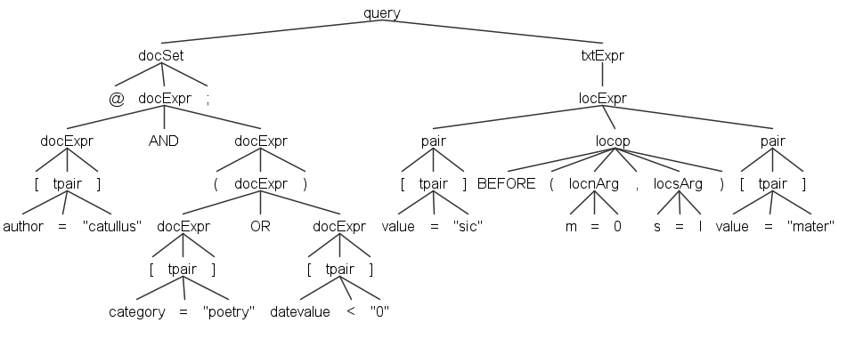

# Model

- [Model](#model)
  - [Overview](#overview)
  - [Query Grammar](#query-grammar)
    - [Pairs](#pairs)
      - [Comparison Operators](#comparison-operators)
      - [Privileged Attributes](#privileged-attributes)
    - [Connecting Pairs](#connecting-pairs)
    - [Sections](#sections)

## Overview

In the Pythia model, searching is ultimately finding all the _document's positions_ whose _metadata_ match the specified criteria, in the scope of the specified subset of the index.

As we have seen, metadata are modeled as attributes, i.e. essentially name=value pairs. Thus, matching metadata means matching attributes, i.e. finding those attributes with a specific name and/or value.

For instance, searching for the word `sic` means matching all the occurrences of tokens whose attribute `value` (the attribute representing a token's text) is equal to `sic`.

Of course, a token item may have many other attributes, like e.g. part of speech (as detected by a POS tagger), syllables count, letters count, miscellaneous linguistic classifications (e.g. foreign word, dialectal word, technical term, personal name, geographical name...), etc. There is no limit to the attributes we can attach to each item, and thus to the types of search we can perform.

In this context, any searchable entity in Pythia gets dematerialized into a span of document positions: in a word the span corresponds to a single position; in a text structure like a sentence or a verse it corresponds to a range. Whatever the entity, it can be linked to any number of attributes. Ultimately, we get to these entities (and their corresponding positions) via attributes matching.

So, here the traditional full text search engine approach, where words are indexed and their position is either discarded or seen as an addition, is somewhat reversed: we do not focus on words, but rather on positions; and these positions happen to locate words, or text structures. Whatever the entity, it gets any number of attributes, representing the entry point for matching.

Documents too have attributes, but their model is different, because they are not position-based, as they are the container of text, rather than its content. Documents are containers with metadata, while corpora are just arbitrarily defined groups of documents. Both these entities serve to specify a limited context for searches.

More concretely, in a Pythia query matching attributes is done via **pairs**, each with the form _attribute name + operator + "attribute value"_. For instance, when you look for the word `chommoda`, you are really looking for a pair with these properties:

- attribute **name** = `value` (the word's text value is represented by an attribute with this name).
- **operator** = _equals_.
- attribute **value** = `"chommoda"`.

## Query Grammar

### Pairs

Each pair, whatever the entity it refers to, is wrapped in square brackets, and includes a name, an operator, and a value, or just a name when we just test for its existence (for privileged attributes only, see below): the query syntax is thus like `[name operator "value"]`.

Attribute **names** are not case-sensitive. Attribute names referring to _structures_ are prefixed with `$`, which distinguishes them from token attributes (there is no possibility of confusing them with document attributes, as these are in a separate section). Thus, a structure representing a single verse in a poetic text might have name `l` (=line), and would be represented as `$l` in the query language.

Attribute **values** are always included in `""`, even when they are numeric. They can include _escapes_, with the form `&HHHH;` where `HHHH` is the Unicode hex character code to be represented.

#### Comparison Operators

The available **operators** are 14, inspired by CSS attribute selectors:

- `=` equals (textual comparison).
- `<>` not equals (textual comparison).
- `*=` contains (uses a `LIKE` expression).
- `^=` starts with (uses a `LIKE` expression).
- `$=` ends with (uses a `LIKE` expression).
- `?=` wildcards (uses a `LIKE` expression). Allowed wildcards are `?`=any single character, and `*`=any number of any characters.
- `~=` regular expression (with different SQL implementations, e.g. `dbo.RegexIsMatch('text', 'expr')` in SQL Server, `REGEXP` function in MySql, `~` in PostgreSQL).
- `%=` fuzzy matching with a treshold. The default treshold value is 0.9; you can specify a different treshold by adding it to the end of the value, prefixed by `:`. For instance, `[value%="chommoda:0.75"]`, or just `[value%="chommoda"]` to use the 0.9 treshold.

Numeric comparison operators are `==`, `!=`, `<`, `>`, `<=`, `>=`. These can be applied to numeric values only. Technically, attributes values are all modeled as strings, so that they can represent anything; but when using numeric operators, these values will be converted into (and thus treated as) numeric values. This implies that in constrast with systems like e.g. Lucene, where numeric values are handled as strings so that for instance you have to store 0910 to let it compare correctly with 1256, this is not required for Pythia; here, you just have to use the numeric operators, which implicitly cast the string value into a number.

#### Privileged Attributes

As we have seen, from the point of view of the user all the attributes are equal, and can be freely queried for each item, either it is a document, a token, or a structure.

Anyway, internally some of these attributes are privileged, in the sense that they are stored in a different way in the index, which allows for better performance and smaller query code.

The names for these attributes are reserved, so you should avoid using them for your own additional attributes.

These attributes are, for each item:

- _document_'s privileged attributes: `author`, `title`, `date_value`, `sort_key`, `source`, `profile_id`.
- _token_'s privileged attributes: `value`, `language`, `position`, `length`.
- _structure_'s privileged attributes: `name`, `start_position`, `end_position`.

The pairs including non-privileged attributes may omit the operator and value when just testing for the existence of the attribute. This is only syntactic sugar: `$l` is equivalent to `$name="l"`. Instead, `$l="1"` refers to a non-privileged attribute named `l` with value equal to `1`.

### Connecting Pairs

Pairs can be connected via logical or positional operators, and precedence can be expressed by parentheses.

A different set of **logical** operators can be used according to their context (section, see below):

- in the _document section_: `AND`/`OR`/`AND NOT`, eventually grouped by `()`.
- in the _text section_: `OR` or location operators, eventually grouped by `()`. Location operators implicitly are all in an `AND` relationship with their left node. In fact, `AND` as a standalone operator is not defined, as in the context of a concordance search engine it would make little sense to find 2 words which happen to be at _any_ distance within the same document. Rather, a positional relationship is always implied by an AND to make the search meaningful (we are looking for connected words in some linguistically motivated context, rather than for documents matching several words, whatever their mutual relationships).

**Positional operators** are in fact specializations of `AND` with positional conditions. They are listed below with their arguments. All of them can be negated by prefixing a `NOT` (note that in this case the `s` argument is not allowed, as it would be meaningless).

- `NEAR(n,m,s)`: filters the first pair so that it must be at the specified distance from the second pair, either before or after it.
- `BEFORE(n,m,s)`: filters the first pair so that it must be before the second pair, at the specified distance from it.
- `AFTER(n,m,s)` filters the first pair so that it must be after the second pair, at the specified distance from it.
- `INSIDE(ns,ms,ne,me,s)`: filters the first pair so that it must be inside the span defined by the second pair, eventually at the specified distance from the container start or end.
- `OVERLAPS(n,m,s)`: filters the first pair so that its span must overlap the one defined by the second pair, eventually by the specified amount of positions.
- `LALIGN(n,m,s)`: filters the first pair so that its span must left-align with the one defined by the second pair: `A` can start with or after `B`, but not before `B`.
- `RALIGN(n,m,s)`: filters the first pair so that its span must right-align with the one defined by the second pair: `A` can end with or before `B`, but not after `B`.

The arguments can be specified in any order, each prefixed by its name followed by an equals sign and its value. For instance, `BEFORE(m=0,s=l)` specifies arguments `m` with value 0, and `s` with value `l`. The arguments names are listed here:

- `n`: minimum distance (0-N). Defaults to 0 if not specified.
- `m`: maximum distance (0-N). Defaults to `int`'s max value (a 32-bits signed integer) if not specified.
- `s`: structure context name. When specified, the second pair must be found inside the same structure including the first pair.

- `ns`: minimum distance (0-N) from structure start.
- `ms`: maximum distance (0-N) from structure start.
- `ne`: minimum distance (0-N) from structure end.
- `me`: maximum distance (0-N) from structure end.

In the current implementation, each operator corresponds to a PL/pgSQL function, conventionally prefixed with `pyt_`. These functions receive the arguments listed above in addition to the positions being tested, which are handled by the search system.

### Sections

The Pythia query language has three main sections:

1. **corpus** filters (optional). The corpus section is just a list of corpora IDs in `@@...;`. For the section to match, it is enough to match any of the listed corpora IDs.

2. **document** filters section (optional). The documents set is represented by an expression of pairs inside `@...;`, connected by `AND`/`OR`/`AND NOT`/`OR NOT`, and eventually grouped by `()`.

3. **tokens** and **structures** section (required). An expression of pairs, each inside `[...]`, connected by `OR` or a location operator (e.g. `NEAR`), and eventually grouped by `()`. Location operators would not be useful in documents and corpora sections, as documents and corpora do not refer to positions.

Thus, a query's skeleton is (whitespaces are not relevant, but I place sections in different lines just to make the query more readable):

```txt
@@...corpus...;
@...document...;
...tokens and structures...
```

where only the last section is required, while the first two refer to the search scope, as defined by documents (`@`) and their groups (corpora: `@@`).

As a sample, consider this query (whitespaces are irrelevant; see below for the details):

```txt
@@neoteroi rhetoric;
@[author="Catullus"] AND ([date_value>="0"] OR [category="poetry"]);
[value="hionios"] OR ([value="sic"] BEFORE(m=0,s=l) [value="mater"] BEFORE(m=0,s=l) [value="sic"])
```

Here we have:

- a _documents_ section, including 3 pairs for author, category, and date value, connected by logical operators and grouped with parentheses. Here we must match all the documents whose author is `Catullus`, having either their category equal to `poetry` or their date value less than `0` (which for these documents means B.C.). This limits the search only to the documents matching these criteria.

- a _text_ (=tokens/structures) section, including 4 pairs; the first pair (`hionios`) is an alternative match for the second expression, including another value (`sic`). This value is further filtered by its location with reference to the next 2 words, `mater` and `sic` again. Location operators being binary, each connects the left token (filter target) with the right token (filter condition). So, in this example `mater` adds a filter to the first `sic`; in turn, the second `sic` adds a filter to `mater`. This means that we must match a token with value `sic`, but only before to a token with value `mater` at a distance of no more than 0 token positions, and inside the same verse; in turn, this `mater` must appear immediately before another `sic`, and inside the same verse. Positional operators have arguments, included between `()`, each prefixed by `:`. In the case of `BEFORE` (see below for more), the allowed arguments are `(:N:M:S)`, where `N`=minimum distance, `M`=maximum distance, `S`=shared context structure. So `(::0:l)` means `M`=0 and `S`=`l`ine, i.e. maximum distance 0 in the context of the _same_ line (the minimum distance `N` is not used, whence the initial `::` rather than `:`). So, at line 5 of Catullus' poem 84, dated one century before Christ, `credo, >sic mater, sic< liber avunculus eius`, this query matches the first `sic` only as it happens to be immediately followed by `mater`, which in turn must be immediately followed by another `sic`.

The following picture represents the syntax tree for a shorter version of the above query:

```txt
@[author="catullus"] AND ([category="poetry"] OR [datevalue<"0"]);[value="sic"] BEFORE(m=0,s=l) [value="mater"]
```


