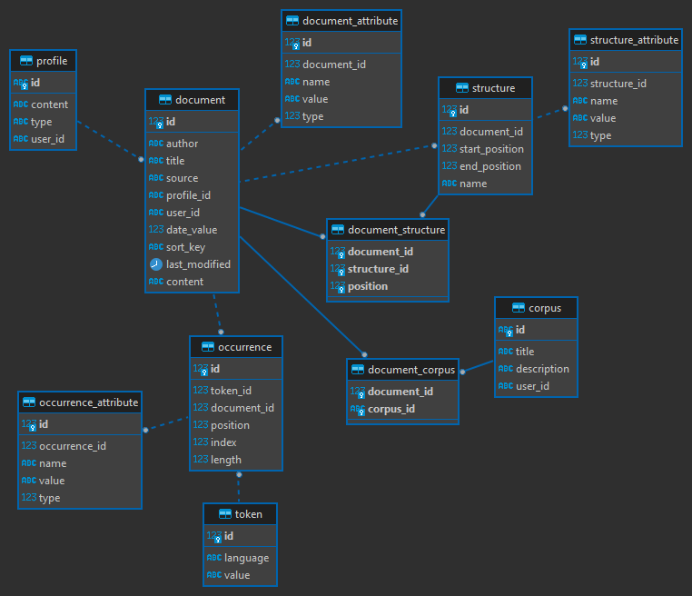

# Storage

The Pythia index has a simple architecture, focused around a few entities.

The central entity is the **document**. A document is any indexed text source. Please note that a text source is not necessarily a text: it can be any digital format from which text can be extracted, just like in most search engines.

Documents have a set of fixed metadata (author, title, source, etc.), plus any number of custom metadata. In both these cases, metadata have the form of a list of **attributes**. An attribute is just a name/value pair decorated with a type (e.g. textual, numeric, etc.).

Documents can be grouped under **corpora**, with no limits. A single document may belong to any number of different corpora. Corpora are just a way to group documents under a label, for whatever purpose.

Each document is analyzed into **tokens** ("words"). Just like for documents, a token has a set of fixed and a set of custom metadata. As for fixed metadata, above all a token has a text value and an optional language; further, it ahas the ID of the document it belongs to, its position, character index and length. Also, tokens may have any number of custom attributes.

When analyzing a text, tokens are generated and passed to an index repository. Typically the repository splits the token into a token proper and its **occurrences**. The token just has value and language; the occurrence defines each occurrence of that token in every document where it is found (document ID, position, index, length, and any other attributes).

Finally, arbitrary ranges of tokens can define some sort of **structure** in the text: e.g. a verse, a sentence, etc. A structure has a fixed set of metadata defining its position and extent (via start and end position) and an arbitrary name. Additionally, it can have any number of attributes, as above.

So, attributes can be freely attached to documents, occurrences, and structures.

The following schema shows these entities in their RDBMS-based implementation:

Here, some of the tables represent implementation details. For instance, tokens coming from analysis are stored as occurrences of tokens in `occurrence` and `token` (which results in a much more compact list of tokens), and structure positions are expanded into a full list in `document_structure`.
