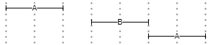
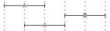
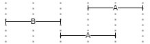
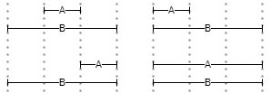
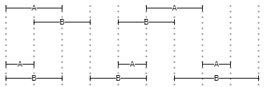
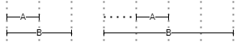
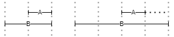

# Query

- [Query](#query)
  - [Pairs](#pairs)
    - [Pair Name](#pair-name)
    - [Pair Value](#pair-value)
    - [Pair Operator](#pair-operator)
    - [Logical Operators](#logical-operators)
    - [Location Operators](#location-operators)
      - [Near](#near)
      - [Before](#before)
      - [After](#after)
      - [Inside](#inside)
      - [Overlaps](#overlaps)
      - [Lalign](#lalign)
      - [Ralign](#ralign)
  - [Sections](#sections)

The Pythia query language is a DSL used to build SQL-based queries from much simpler expressions.

>The ANTLR grammar for the Pythia query language is in `Pythia.Core/Query/PythiaQuery.g4`.

As explained about the [Pythia model](01-model.md), the index is just a set of _objects_, which in most cases represent _tokens_ ("words"), but can also represent sentences, verses, paragraphs, or any other text _structure_. Each of these objects has any number of metadata (named _attributes_). A search gets to these objects via their metadata.

So, a search essentially matches an attribute with a value using some comparison type. This matching is the core of any search, and represents what is called a _pair_, i.e. the union of an attribute's name with a value via a comparison operator.

A query can consist of a _single pair_, or connect _more pairs_ with a number of logical or positional (location) operators, eventually defining precedence with brackets.

## Pairs

Each pair, whatever the entity it refers to, is wrapped in square brackets, and includes a name, an operator, and a value, or just a name when we just test for its existence (for privileged attributes only: see below). The query syntax is thus:

```txt
[name operator "value"]
```

### Pair Name

The pair's name is just the name of any valid attribute for the type of object we want to search.

From the point of view of the user all the attributes are equal, and can be freely queried for each item, either it is a document, a token, or a structure. Yet, internally some of these attributes are **privileged**, in the sense that they are considered _intrinsic_ properties of the objects.

These privileged attributes correspond to fields of the `span` (or `document`, when searching for documents) table, rather than to name=value pairs in the `span_attribute` (or `document_attribute`) table linked to it. All the other attributes, which are extensible, are rather linked to their table via the corresponding `TABLENAME_attribute` table. This implies that the query syntax will be different (and a join can be required) according to the attribute being searched.

The names of privileged attributes are reserved; so, when defining your own attributes, you must avoid using these names for them. The reserved names are (in addition to `id`, `profile_id`, `lemma_id`, `word_id` which would anyway not make to include in a query):

- _document_'s privileged attributes: `author`, `title`, `date_value`, `sort_key`, `source`, `profile_id`.
- _span_'s privileged attributes: `p1`, `p2`, `index`, `length`, `language`, `pos`, `lemma`, `value`, `text`.

👉 Attribute **names** are case-insensitive.

Attribute names referring to **structures**, i.e. sequences of 1-N text spans, are prefixed with `$`, which distinguishes them from token attributes in the query (there is no possibility of confusing them with document attributes, as these are in a separate section). So, `[$name="fp-lat"]` means that we want to find all the spans of type `fp-lat`, i.e. all the Latin phrases.

The pairs including non-privileged attributes may omit operator and value when just testing for the existence of the attribute. This is only syntactic sugar: `$fp-lat` is equivalent to `$name="fp-lat"`. In the same way, `$l` would be equivalent to `$name="l"` (line). Instead, `$l="1"` would rather refer to a non-privileged attribute named `l` with value equal to `1`.

>In practice, given that all structures are token-based, any span whose type is not `tok` (=token span) is a structure span.

In the context of a text structure match, if we want to match also the structure's value, we can use `_` as the value prefix, which assumes that a structure name pair precedes this. For instance, `[$fp-lat] AND [_value="pro tempore"]`, where `_` is the prefix for the structure's attribute, means that we want to match all structure spans of type `fp-lat` and whose value is `pro tempore`.

### Pair Value

Attribute **values** are always included in double quotes `""`, even when they are numeric. The syntax of the value may vary according to the operator selected. For instance, if you are using a wildcard matching operator, characters `?` and `*` will represent wildcards rather than literals.

Optionally, you can include _escapes_ inside the quotes, with the form `&HHHH;` where `HHHH` is the Unicode hex (BMP) character code to be represented.

### Pair Operator

The available pair operators are 14, inspired by CSS attribute selectors:

- `=` **equals** (textual comparison, literal).
- `<>` **not equals** (textual comparison, literal).
- `*=` **contains** (uses a `LIKE` expression, literal).
- `^=` **starts with** (uses a `LIKE` expression, literal).
- `$=` **ends with** (uses a `LIKE` expression, literal).
- `?=` **wildcards** (uses a `LIKE` expression). Allowed wildcards are `?`=any single character, and `*`=any number of any characters.
- `~=` **regular expression** (with different SQL implementations, e.g. `dbo.RegexIsMatch('text', 'expr')` in SQL Server, `REGEXP` function in MySql, `~` in PostgreSQL).
- `%=` **fuzzy matching** with a treshold. The default treshold value is 0.9; you can specify a different treshold by adding it to the end of the value, prefixed by `:`. For instance, `[value%="chommoda:0.75"]`, or just `[value%="chommoda"]` to use the 0.9 treshold.
- **numeric** comparison operators: `==`, `!=`, `<`, `>`, `<=`, `>=`. These can be applied to numeric values only.

>🔧 Technically, attributes values are all modeled as strings, so that they can represent anything; but when using numeric operators, these values will be converted into (and thus treated as) numeric values. This implies that in constrast with systems like e.g. Lucene, where numeric values are handled as strings so that for instance you have to store `0910` to let it compare correctly with `1256`, this is not required for Pythia; here, you just have to use the numeric operators, which implicitly cast the string value into a number.

Thus, for instance this pair:

```txt
[value]="example"
```

just finds the word "example". Here, you can replace the `=` operator with any other one (except of course the numeric operators, as in this sample we are looking for text); so, you might type:

```txt
[value]^="exam"
```

to find all the words starting with `exam`, or:

```txt
[value]$="ple"
```

to find all the words ending with `ple`; etc.

Of course, you are not limited to a single pair. Multiple pairs can be **connected** via _logical_ or _location_ operators, and precedence can be expressed by _parentheses_.

### Logical Operators

A different set of **logical** operators can be used according to their context (section, see [below](#sections)):

- in the _document section_: `AND`/`OR`/`AND NOT`, eventually grouped by `()`.
- in the _text section_: `OR` or location operators, eventually grouped by `()`.

>Location operators implicitly are all in an `AND` relationship with their left node. In fact, `AND` as a standalone operator is not defined, as in the context of a concordance search engine it would make little sense to find 2 words which happen to be at _any_ distance within the same document. Rather, a positional relationship is always implied by an AND to make the search meaningful (we are looking for connected words in some linguistically motivated context, rather than for documents matching several words, whatever their mutual relationships).

### Location Operators

Location operators are specializations of `AND` with added conditions based on the position of the objects in their document. All the positions are based on token positions.

Location operators have one or more **arguments**, expressed between brackets after their name. Arguments can be specified in any order; each is prefixed by its name, followed by an equals sign and its value. For instance, `BEFORE(m=0,s=l)` specifies arguments `m` with value 0, and `s` with value `l`.

For your reference, all the arguments names are listed here; but of course not all of the operators use all of them:

- `n`: minimum distance (0-N). Defaults to 0 if not specified.
- `m`: maximum distance (0-N). Defaults to `int`'s max value (a 32-bits signed integer) if not specified.
- `s`: structure context name. When specified, the second pair must be found inside the same structure including the first pair.
- `ns`: minimum distance (0-N) from structure start.
- `ms`: maximum distance (0-N) from structure start.
- `ne`: minimum distance (0-N) from structure end.
- `me`: maximum distance (0-N) from structure end.

👉 All the location operators can be **negated** by prefixing a `NOT` (note that in this case the `s` argument is not allowed, as it would be meaningless).

> 🛠️ In the current implementation, each operator corresponds to a PL/pgSQL function, conventionally prefixed with `pyt_`. These functions receive the arguments listed above in addition to the positions being tested, which are handled by the search system.

The potential of these alignment operators may not be immediately evident, but they can provide a lot of power for contextual searches.

To start with, you can search for a word before or after or near another word, specifying the minimum and maximum distance, and also limiting results to those words included in the same larger encompassing structure (e.g. a sentence). This way, we are not limited to a mechanical numeric criterion, like a raw numeric distance, which might be useless when e.g. you are looking for pairs of words, but one of these happens to be at the end of a sentence, and the other one at the beginning of the next one.

In fact, the power of these operator shines when dealing with larger structures; for instance, you can search for a word at the beginning of a verse, i.e. a word left-aligned with a verse with maximum distance=0, or at its end, i.e. right-aligned with maximum distance=0, etc.

Remember that in Pythia everything is an object with properties (including start/end positions, where applicable), whether it's a single word or a larger linguistic structure like phrase, sentence, verse, or even non-strictly linguistic structures like typographic entities as paragraphs. Such objects all have a start and an end position, making them like segments. A token is just a segment where by definition start and end positions coincide, because positions are token-based. So, once any span of text, whatever the analysis level which defined it, has been defined in this geometrical way, you are free to look for any type of alignment between any types of segments, and additionally play with the operation arguments for minimum, maximum, and embracing structure. Once again, this is the effect of a higher abstraction level in the model, the same which "de-materialized" text from a sequence of characters into a set of objects.

#### Near

▶️ `NEAR(n,m,s)`: filters the left expression so that it must be _near_, i.e. at the specified distance (ranging from a minimum -`n`- to a maximum -`m`-) from the second one, either before or after it. For instance, in Figure 1 A is either before or after B; the distance between the left A and B is 1, while the distance between B and the right A is 0.



- Figure 1 - NEAR

#### Before

▶️ `BEFORE(n,m,s)`: filters the left expression so that it must be _before_ the second one, at the specified distance from it. For instance, in Figure 2 two instances of A are before B, either at distance 1 or 0.



- Figure 2 - BEFORE

#### After

▶️ `AFTER(n,m,s)` filters the first expression so that it must be _after_ the second one, at the specified distance from it. This operator mirrors `BEFORE`. For instance, in Figure 3 two instances of A are after B, either at distance 1 or 0.



- Figure 3 - AFTER

#### Inside

▶️ `INSIDE(ns,ms,ne,me,s)`: filters the first expression so that it must be _inside_ the span defined by the second one, optionally at the specified minimum and/or maximum distance from the container start (`ns`, `ms`) or end (`ne`, `me`). For instance, in the 4 examples of Figure 4 A is always inside B, whatever its relative position and extent.



- Figure 4 - INSIDE

#### Overlaps

▶️ `OVERLAPS(n,m,s)`: filters the first expression so that its span must overlap the one defined by the second expression, optionally by the specified amount of positions. Here `n` represents the minimum required overlap, and `m` the maximum allowed overlap. For instance, in the 4 examples of Figure 5 there is always overlap (of extent 1) between A and B.



- Figure 5 - OVERLAPS

#### Lalign

▶️ `LALIGN(n,m,s)`: filters the first expression so that its span must _left-align_ with the one defined by the second expression: `A` can start with or after `B`, but not before `B`. Here, `n` and `m` specify the minimum and maximum offsets from start. For instance, in Figure 6 the left A/B pair has a perfect left alignment (distance=0), while the right pair has offset=1 from the left-alignment position.



- Figure 6 - LALIGN

#### Ralign

▶️ `RALIGN(n,m,s)`: filters the first expression so that its span must _right-align_ with the one defined by the second expression: `A` can end with or before `B`, but not after `B`. This mirrors `LALIGN`. For instance, in Figure 6 the left A/B pair has a perfect right alignment (distance=0), while the right pair has offset=1 from the right-alignment position.



- Figure 7 - RALIGN

## Sections

Text objects (tokens and structures) are not the only available objects in Pythia; there are also documents and corpora. These are used to further delimit the results to documents matching a specific query, or to predefined sets of documents (corpora).

To allow for a simpler syntax, conditions about corpora, documents, and text are specified in three different sections of a query:

1. **corpus** filters (optional). The corpus section is just a list of corpora IDs in `@@...;`. For the section to match, it is enough to match any of the listed corpora IDs.

2. **document** filters section (optional). The documents set is represented by an expression of pairs inside `@...;`, connected by `AND`/`OR`/`AND NOT`/`OR NOT`, and eventually grouped by `()`.

3. **tokens** and **structures** section (required). An expression of pairs, each inside `[...]`, connected by `OR` or a location operator (e.g. `NEAR`), and eventually grouped by `()`. Location operators would not be useful in documents and corpora sections, as documents and corpora do not refer to positions.

Thus, a query's skeleton is (whitespaces are not relevant, but I place sections in different lines just to make the query more readable):

```txt
@@...corpus...;
@...document...;
...tokens and structures...
```

where only the last section is required, while the first two refer to the search scope, as defined by documents (`@`) and their groups (corpora: `@@`).

As a sample, consider this query (whitespaces are irrelevant; see below for the details):

```txt
@@neoteroi rhetoric;
@[author="Catullus"] AND ([date_value>="0"] OR [category="poetry"]);
[value="hionios"] OR ([value="sic"] BEFORE(m=0,s=l) [value="mater"] BEFORE(m=0,s=l) [value="sic"])
```

Here we have:

- a _documents_ section, including 3 pairs for author, category, and date value, connected by logical operators and grouped with parentheses. Here we must match all the documents whose author is `Catullus`, having either their category equal to `poetry` or their date value less than `0` (which for these documents means B.C.). This limits the search only to the documents matching these criteria.

- a _text_ (=tokens/structures) section, including 4 pairs; the first pair (`hionios`) is an alternative match for the second expression, including another value (`sic`). This value is further filtered by its location with reference to the next 2 words, `mater` and `sic` again. Location operators being binary, each connects the left token (filter target) with the right token (filter condition). So, in this example `mater` adds a filter to the first `sic`; in turn, the second `sic` adds a filter to `mater`. This means that we must match a token with value `sic`, but only before to a token with value `mater` at a distance of no more than 0 token positions (`m=0` means a maximum distance of 0), and inside the same verse (`s=l` means a common ancestor structure named `l`=line); in turn, this `mater` must appear immediately before another `sic`, and inside the same verse. So, at line 5 of Catullus' poem 84, dated one century before Christ, `credo, >sic mater, sic< liber avunculus eius`, this query matches the first `sic` only as it happens to be immediately followed by `mater`, which in turn must be immediately followed by another `sic`.

The following picture represents the syntax tree for a shorter version of the above query:

```txt
@[author="catullus"] AND ([category="poetry"] OR [datevalue<"0"]);[value="sic"] BEFORE(m=0,s=l) [value="mater"]
```


