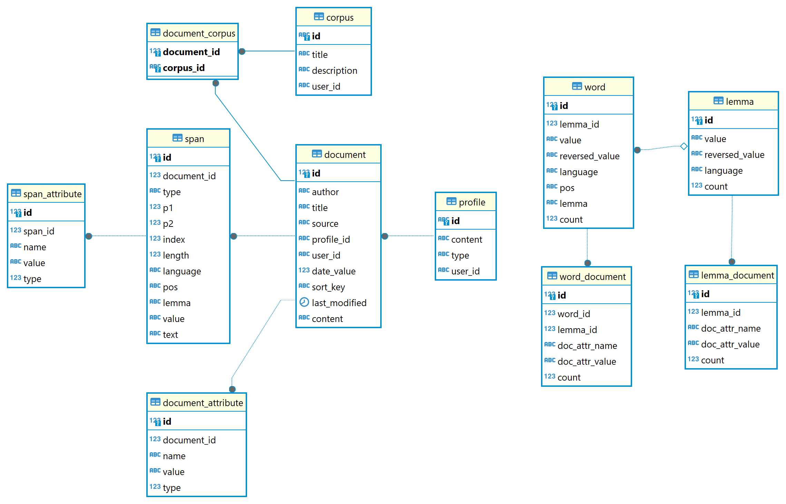

# Storage

The Pythia default implementation relies on a RDBMS. So, querying a corpus means querying a relational database, which allows for a high level of customizations and usages by third-party systems.

The database has a simple architecture, focused around a few entities, depicted in this diagram:

While the general architecture is designed to be flexible, the current Pythia implementation is based on PostgreSQL, which is the best choice for flexibility, performance and maintanability. Consequently, context-related functions are implemented in `PL/pgSQL`. Database schema and functions are defined in these files:

- `Pythia.Sql.PgSql`/`Assets`/`Schema.pgsql`
- `Pythia.Sql.PgSql`/`Assets`/`Functions.pgsql`

The SQL code is organized as follows:

- all the SQL components non specific to a particular SQL implementation are found in the `Pythia.Sql` project.
- PostgreSQL-specific components and overrides are found in `Pythia.Sql.PgSql`.
- the core of the SQL translation is found in `Pythia.Sql`, in `SqlPythiaListener`. A higher-level component leveraging this listener, `SqlQueryBuilder`, is used to build SQL queries from Pythia queries. Also, another query builder is `SqlWordQueryBuilder`, which is used to browse the words and lemmata index.

The tables are:

- `document`: documents. These are the texts being indexed.
- `document_attribute`: custom attributes of documents. Besides a set of fixed metadata (author, title, source, etc.), defined in the `document` table, documents can have any number of custom metadata in `document_attribute`. Each attribute is just a name=value pair, decorated with a type (e.g. textual, numeric, etc.).
- `corpus`: corpora, i.e. user-defined collection of documents. Corpora are just a way to group documents under a label, for whatever purpose, typically to limit searches to a specific subset of documents.
- `document_corpus`: links between document ID and corpus ID.
- `span`: this is the core of the index. Each document is analyzed into text _spans_. These are primarily tokens, but can also be any larger textual structure, like sentences, verses, paragraphs, etc. All these structures can freely overlap and can be added at will. A special field (`type`) is used to specify the span's type. Whatever the span type, its _position_ is always _token-based_, as the token here is the atomic structure in search: 1=first token in the document, 2=second, etc. Every span defines its position with two such token ordinals, named P1 and P2. So a span is just the sequence of tokens starting with the token at P1 and ending with the token at P2 (included) in a given document. Thus, when dealing with tokens P1 is always equal to P2. This also implies that any span whose type is not token (`tok`) is a _text structure span_, rather than a _token span_. In code and documentation we often use the shorter terms "structure" for text a structure span, and "token" for token spans.
- `span_attribute`: just like documents, a span has a set of fixed attributes (like position, value, or language, in the `span` table) and custom attributes (in `span_attribute`).
- `word`, `lemma`: words and lemmata: additionally, the database can include a superset of calculated data essentially related to word forms and their base form (lemma). First, spans are used as the base for building a list of _words_ (table `word`), defined as all the unique combinations of each token's language, value, part of speech, and lemma. Each word also has its pre-calculated total count of the corresponding tokens. In turn, words are the base for building a list of _lemmata_ (table `lemma`, provided that your indexer uses some kind of lemmatizer), representing all the word forms belonging to the same base form (lemma). Each lemma also has its pre-calculated total count of word forms. Both words (in `word_count`) and lemmata (in `lemma_count`) have a pre-calculated detailed distribution across documents, as grouped by each of the document's attribute's unique name=value pair.
