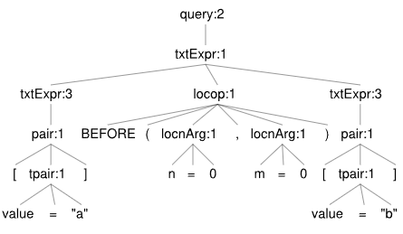

# SQL Query Examples with Location

Here you can find some examples of translation from Pythia to SQL queries related to queries using location operators (like `BEFORE`, `NEAR`, etc.). When using location operators, we can't simply connect CTEs with a SQL operator like `INTERSECT`. Rather, we have to filter the left-expression with the result of the right expression, using an INNER JOIN with a subquery, whose matching clause states that the positions found must belong to the same document, and get `true` from the positional function used.

- see also: [SQL query examples without location](sql-ex-non-locop.md)

> ⚠️ Note: in the syntax trees you might notice that the token values do not necessarily correspond to those used in the sample query; rather, they are just symbols like `a`, `b`, etc. This is because there we focus on the tree structure, while not caring about details about literal values.

## Before

```txt
[value="in"] BEFORE(n=0,m=0) [value="persona"]
```



```sql
-- CTE list
WITH s1 AS
(
  -- s1: value EQ "in"
  SELECT DISTINCT
  occurrence.document_id,
  occurrence.position AS p1,
  occurrence.position AS p2,
  't' AS entity_type,
  occurrence.id AS entity_id
  FROM occurrence
  INNER JOIN token ON occurrence.token_id=token.id
  WHERE
  LOWER(token.value)=LOWER('in')
) -- s1
, s2 AS
(
  -- s2: value EQ "persona"
  SELECT DISTINCT
  occurrence.document_id,
  occurrence.position AS p1,
  occurrence.position AS p2,
  't' AS entity_type,
  occurrence.id AS entity_id
  FROM occurrence
  INNER JOIN token ON occurrence.token_id=token.id
  WHERE
  LOWER(token.value)=LOWER('persona')
) -- s2
-- result
, r AS
(
SELECT s1.* FROM s1
-- pyt_is_before_within
INNER JOIN (
SELECT s2.* FROM s2
) AS s1_s2
ON s1.document_id=s1_s2.document_id AND
pyt_is_before_within(s1.p1, s1.p2, s1_s2.p1, s1_s2.p2, 0, 0)
) -- r

--merger
SELECT DISTINCT
occurrence.document_id,
occurrence.position,
occurrence.index,
occurrence.length,
entity_type,
entity_id,
token.value,
document.author,
document.title,
document.sort_key
FROM occurrence
INNER JOIN token ON occurrence.token_id=token.id
INNER JOIN document ON occurrence.document_id=document.id
INNER JOIN r ON occurrence.document_id=r.document_id
AND (occurrence.position=r.p1 OR occurrence.position=r.p2)
ORDER BY document.sort_key, occurrence.position
LIMIT 20 OFFSET 0
```

## Inside

The inside operator finds a token inside some structure, eventually from a specific distance from its edges. Here we look for words ending with `ter` inside a verse (structure `l`ine), additionally ensuring that the maximum distance of the word from the verse end is 0. This has the effect of finding a word at the end of the verse, even though for this purpose you might just want to use a simpler `RALIGN` operator.

`[value$="ter"] INSIDE(me=0) [$l]`

```sql
-- CTE list
WITH s1 AS
(
  -- s1: value ENDSWITH "ter"
  SELECT DISTINCT
  occurrence.document_id,
  occurrence.position AS p1,
  occurrence.position AS p2,
  't' AS entity_type,
  occurrence.id AS entity_id
  FROM occurrence
  INNER JOIN token ON occurrence.token_id=token.id
  WHERE
  LOWER(token.value) LIKE ('%' || LOWER('ter'))
) -- s1
, s2 AS
(
  -- s2: $l
  SELECT DISTINCT
  structure.document_id,
  structure.start_position AS p1,
  structure.end_position AS p2,
  's' AS entity_type,
  structure.id AS entity_id
  FROM structure
  WHERE
  EXISTS
  (
    SELECT * FROM structure_attribute sa
    WHERE sa.structure_id=structure.id
    AND LOWER(sa.name)=LOWER('l')
  )
) -- s2
-- result
, r AS
(
SELECT s1.* FROM s1
-- pyt_is_inside_within
INNER JOIN (
SELECT s2.* FROM s2
) AS s1_s2
ON s1.document_id=s1_s2.document_id AND
pyt_is_inside_within(s1.p1, s1.p2, s1_s2.p1, s1_s2.p2, 0, 2147483647, 0, 2147483647)
) -- r

--merger
SELECT DISTINCT
occurrence.document_id,
occurrence.position,
occurrence.index,
occurrence.length,
entity_type,
entity_id,
token.value,
document.author,
document.title,
document.sort_key
FROM occurrence
INNER JOIN token ON occurrence.token_id=token.id
INNER JOIN document ON occurrence.document_id=document.id
INNER JOIN r ON occurrence.document_id=r.document_id
AND (occurrence.position=r.p1 OR occurrence.position=r.p2)
ORDER BY document.sort_key, occurrence.position
LIMIT 20 OFFSET 0
```

🔬 Dissection: here we also show the partial results of CTE queries to better explain the SQL code.

Result of CTE `s1`:

| document_id | p1 | p2 | entity_type | entity_id |
|-------------|----|----|-------------|-----------|
| 1           | 28 | 28 | t           | 28        |
| 1           | 49 | 49 | t           | 49        |
| 1           | 51 | 51 | t           | 51        |
| 2           | 29 | 29 | t           | 103       |

i.e. using this query:

```sql
select o.id, t.value from occurrence o
inner join token t on o.token_id = t.id 
where o.id in (28,49,51,103)
```

These are the occurrences of words:

- mater (28)
- leniter (49)
- leviter (51)
- iuppiter (103)

Result of CTE `s2`: these are the first and last position for each line.

| document_id | p1  | p2  | entity_type | entity_id |
|-------------|-----|-----|-------------|-----------|
| 1           | 3   | 8   | s           | 8         |
| 1           | 9   | 13  | s           | 9         |
| 1           | 14  | 20  | s           | 10        |
| 1           | 21  | 25  | s           | 11        |
| 1           | 26  | 32  | s           | 12        |
| 1           | 33  | 38  | s           | 13        |
| 1           | 39  | 45  | s           | 14        |
| 1           | 46  | 51  | s           | 15        |
| 1           | 52  | 57  | s           | 16        |
| 1           | 58  | 62  | s           | 17        |
| 1           | 63  | 68  | s           | 18        |
| 1           | 69  | 74  | s           | 19        |
| 2           | 2   | 10  | s           | 29        |
| 2           | 11  | 16  | s           | 30        |
| 2           | 17  | 23  | s           | 31        |
| 2           | 24  | 30  | s           | 32        |
| 2           | 31  | 36  | s           | 33        |
| 2           | 37  | 43  | s           | 34        |
| 2           | 44  | 50  | s           | 35        |
| 2           | 51  | 57  | s           | 36        |
| 2           | 59  | 62  | s           | 37        |
| 2           | 63  | 68  | s           | 38        |
| 2           | 69  | 73  | s           | 39        |
| 2           | 74  | 76  | s           | 40        |
| 2           | 77  | 81  | s           | 41        |
| 2           | 82  | 86  | s           | 42        |
| 2           | 87  | 90  | s           | 43        |
| 2           | 91  | 92  | s           | 44        |
| 2           | 93  | 97  | s           | 45        |
| 2           | 98  | 103 | s           | 46        |
| 2           | 104 | 107 | s           | 47        |
| 2           | 108 | 109 | s           | 48        |
