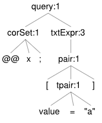

# SQL Query Examples without Location

Here you can find some examples of translation from Pythia to SQL queries related to queries not using location operators (like `BEFORE`, `NEAR`, etc.).

- see also: [SQL query examples with location](sql-ex-locop.md)

> ⚠️ Note: in the syntax trees you might notice that the token values do not necessarily correspond to those used in the sample query; rather, they are just symbols like `a`, `b`, etc. This is because there we focus on the tree structure, while not caring about details about literal values.

## Text Pairs

### Single Pair

```txt
[value="affidamento"]
```


Single token pair. Note that even though we deal with a token, CTEs always return a start and an end position (`p1` and `p2`). This allows to uniformly handle location operators, whatever the object involved.

```sql
-- CTE list
WITH s1 AS
(
  -- s1: value EQ "affidamento"
  SELECT DISTINCT
  occurrence.document_id,
  occurrence.position AS p1,
  occurrence.position AS p2,
  't' AS entity_type,
  occurrence.id AS entity_id
  FROM occurrence
  INNER JOIN token ON occurrence.token_id=token.id
  WHERE
  LOWER(token.value)=LOWER('affidamento')
) -- s1
-- result
, r AS
(
SELECT s1.* FROM s1
) -- r

--merger
SELECT DISTINCT
occurrence.document_id,
occurrence.position,
occurrence.index,
occurrence.length,
entity_type,
entity_id,
token.value,
document.author,
document.title,
document.sort_key
FROM occurrence
INNER JOIN token ON occurrence.token_id=token.id
INNER JOIN document ON occurrence.document_id=document.id
INNER JOIN r ON occurrence.document_id=r.document_id
AND (occurrence.position=r.p1 OR occurrence.position=r.p2)
ORDER BY document.sort_key, occurrence.position
LIMIT 20 OFFSET 0
```

### Several Pairs

```txt
[value="affidamento"] AND [lemma="affidamento"]
```


>Of course here the AND clause does not add anything; it's just to have two pairs instead of one, while still getting the same result of a single one.

```sql
WITH s1 AS
(
  -- s1: value EQ "affidamento"
  SELECT DISTINCT
  occurrence.document_id,
  occurrence.position AS p1,
  occurrence.position AS p2,
  't' AS entity_type,
  occurrence.id AS entity_id
  FROM occurrence
  INNER JOIN token ON occurrence.token_id=token.id
  WHERE
  LOWER(token.value)=LOWER('affidamento')
) -- s1
, s2 AS
(
  -- s2: lemma EQ "affidamento"
  SELECT DISTINCT
  occurrence.document_id,
  occurrence.position AS p1,
  occurrence.position AS p2,
  't' AS entity_type,
  occurrence.id AS entity_id
  FROM occurrence
  INNER JOIN token ON occurrence.token_id=token.id
  WHERE
  EXISTS
  (
    SELECT * FROM occurrence_attribute oa
    WHERE oa.occurrence_id=occurrence.id
    AND LOWER(oa.name)=LOWER('lemma')
    AND LOWER(oa.value)=LOWER('affidamento')
  )
) -- s2
-- result
, r AS
(
SELECT s1.* FROM s1
INTERSECT
SELECT s2.* FROM s2
) -- r

--merger
SELECT DISTINCT
occurrence.document_id,
occurrence.position,
occurrence.index,
occurrence.length,
entity_type,
entity_id,
token.value,
document.author,
document.title,
document.sort_key
FROM occurrence
INNER JOIN token ON occurrence.token_id=token.id
INNER JOIN document ON occurrence.document_id=document.id
INNER JOIN r ON occurrence.document_id=r.document_id
AND (occurrence.position=r.p1 OR occurrence.position=r.p2)
ORDER BY document.sort_key, occurrence.position
LIMIT 20 OFFSET 0
```

Using parentheses and an additional pair:

```txt
[lemma="affidamento"] AND ([value="affidamento"] OR [value="affidamenti"])
```


```sql
-- CTE list
WITH s1 AS
(
  -- s1: lemma EQ "affidamento"
  SELECT DISTINCT
  occurrence.document_id,
  occurrence.position AS p1,
  occurrence.position AS p2,
  't' AS entity_type,
  occurrence.id AS entity_id
  FROM occurrence
  INNER JOIN token ON occurrence.token_id=token.id
  WHERE
  EXISTS
  (
    SELECT * FROM occurrence_attribute oa
    WHERE oa.occurrence_id=occurrence.id
    AND LOWER(oa.name)=LOWER('lemma')
    AND LOWER(oa.value)=LOWER('affidamento')
  )
) -- s1
, s2 AS
(
  -- s2: value EQ "affidamento"
  SELECT DISTINCT
  occurrence.document_id,
  occurrence.position AS p1,
  occurrence.position AS p2,
  't' AS entity_type,
  occurrence.id AS entity_id
  FROM occurrence
  INNER JOIN token ON occurrence.token_id=token.id
  WHERE
  LOWER(token.value)=LOWER('affidamento')
) -- s2
, s3 AS
(
  -- s3: value EQ "affidamenti"
  SELECT DISTINCT
  occurrence.document_id,
  occurrence.position AS p1,
  occurrence.position AS p2,
  't' AS entity_type,
  occurrence.id AS entity_id
  FROM occurrence
  INNER JOIN token ON occurrence.token_id=token.id
  WHERE
  LOWER(token.value)=LOWER('affidamenti')
) -- s3
-- result
, r AS
(
SELECT s1.* FROM s1
INTERSECT
(
  SELECT s2.* FROM s2
UNION
  SELECT s3.* FROM s3
)
) -- r

--merger
SELECT DISTINCT
occurrence.document_id,
occurrence.position,
occurrence.index,
occurrence.length,
entity_type,
entity_id,
token.value,
document.author,
document.title,
document.sort_key
FROM occurrence
INNER JOIN token ON occurrence.token_id=token.id
INNER JOIN document ON occurrence.document_id=document.id
INNER JOIN r ON occurrence.document_id=r.document_id
AND (occurrence.position=r.p1 OR occurrence.position=r.p2)
ORDER BY document.sort_key, occurrence.position
LIMIT 20 OFFSET 0
```

### Structures

```txt
[$name="sent"]
```


```sql
-- CTE list
WITH s1 AS
(
  -- s1: $name EQ "sent"
  SELECT DISTINCT
  structure.document_id,
  structure.start_position AS p1,
  structure.end_position AS p2,
  's' AS entity_type,
  structure.id AS entity_id
  FROM structure
  WHERE
  LOWER(structure.name)=LOWER('sent')
) -- s1
-- result
, r AS
(
SELECT s1.* FROM s1
) -- r

--merger
SELECT DISTINCT
occurrence.document_id,
occurrence.position,
occurrence.index,
occurrence.length,
entity_type,
entity_id,
token.value,
document.author,
document.title,
document.sort_key
FROM occurrence
INNER JOIN token ON occurrence.token_id=token.id
INNER JOIN document ON occurrence.document_id=document.id
INNER JOIN r ON occurrence.document_id=r.document_id
AND (occurrence.position=r.p1 OR occurrence.position=r.p2)
ORDER BY document.sort_key, occurrence.position
LIMIT 20 OFFSET 0
```

## Corpus

```txt
@@x;[value="affidamento"]
```



```sql
-- CTE list
WITH s1 AS
(
  -- s1: value EQ "affidamento"
  SELECT DISTINCT
  occurrence.document_id,
  occurrence.position AS p1,
  occurrence.position AS p2,
  't' AS entity_type,
  occurrence.id AS entity_id
  FROM occurrence
  INNER JOIN token ON occurrence.token_id=token.id
  -- crp begin
  INNER JOIN document_corpus
  ON occurrence.document_id=document_corpus.document_id
  AND document_corpus.corpus_id IN('x')
  -- crp end
  WHERE
  LOWER(token.value)=LOWER('affidamento')
) -- s1
-- result
, r AS
(
SELECT s1.* FROM s1
) -- r

--merger
SELECT DISTINCT
occurrence.document_id,
occurrence.position,
occurrence.index,
occurrence.length,
entity_type,
entity_id,
token.value,
document.author,
document.title,
document.sort_key
FROM occurrence
INNER JOIN token ON occurrence.token_id=token.id
INNER JOIN document ON occurrence.document_id=document.id
INNER JOIN r ON occurrence.document_id=r.document_id
AND (occurrence.position=r.p1 OR occurrence.position=r.p2)
ORDER BY document.sort_key, occurrence.position
LIMIT 20 OFFSET 0
```

## Document

```txt
@[title*="ge"] OR [author="x"];[value="affidamento"]
```


```sql
-- CTE list
WITH s1 AS
(
  -- s1: value EQ "affidamento"
  SELECT DISTINCT
  occurrence.document_id,
  occurrence.position AS p1,
  occurrence.position AS p2,
  't' AS entity_type,
  occurrence.id AS entity_id
  FROM occurrence
  INNER JOIN token ON occurrence.token_id=token.id
  INNER JOIN document ON occurrence.document_id=document.id
  INNER JOIN document_attribute ON occurrence.document_id=document_attribute.document_id
  WHERE
  -- doc begin
  (
  -- s1: title CONTAINS "ge"
  LOWER(document.title) LIKE ('%' || LOWER('ge') || '%')
  OR
  -- s2: author EQ "x"
  LOWER(document.author)=LOWER('x')
  )
  -- doc end
  AND
  LOWER(token.value)=LOWER('affidamento')
) -- s1
-- result
, r AS
(
SELECT s1.* FROM s1
) -- r

--merger
SELECT DISTINCT
occurrence.document_id,
occurrence.position,
occurrence.index,
occurrence.length,
entity_type,
entity_id,
token.value,
document.author,
document.title,
document.sort_key
FROM occurrence
INNER JOIN token ON occurrence.token_id=token.id
INNER JOIN document ON occurrence.document_id=document.id
INNER JOIN r ON occurrence.document_id=r.document_id
AND (occurrence.position=r.p1 OR occurrence.position=r.p2)
ORDER BY document.sort_key, occurrence.position
LIMIT 20 OFFSET 0
```

---

⏮️ [SQL translation](sql.md)

⏭️ [SQL query samples with location](sql-ex-locop.md)
