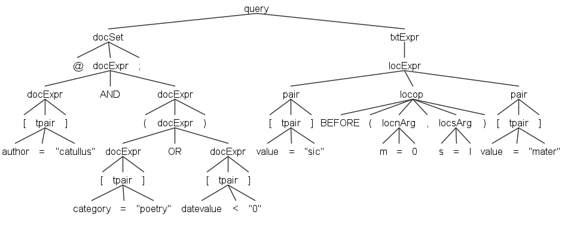
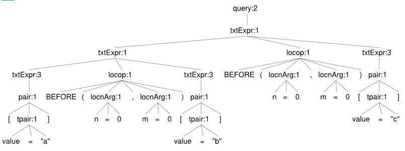

# SQL Translation

- [SQL Translation](#sql-translation)
  - [Query Translation](#query-translation)
    - [Walking the Tree](#walking-the-tree)
  - [Query Overview](#query-overview)
  - [Anatomy](#anatomy)
    - [1. CTE List](#1-cte-list)
    - [2. Result CTE](#2-result-cte)
    - [3. Merger Query](#3-merger-query)

The Pythia default implementation relies on a RDBMS. So, querying a corpus means querying a relational database, which allows for a high level of customizations and usages by third-party systems.

Of course, users are not required to enter complex SQL expressions; rather, they just type queries in a custom domain specific language (or compose them in a graphical UI), which gets automatically translated into SQL.

>🔧 The current Pythia implementation is based on PostgreSQL. Consequently, context-related functions are implemented in `PL/pgSQL` (you can look at this [tutorial](https://www.postgresqltutorial.com/) for more). The repository implementation anyway always relegates any PostgreSQL-specific SQL to a separate code object, while putting most of the logic in a shared code object, working as a parent class from which implementation-specific classes are derived.

## Query Translation

A [Pythia query](query.md), as defined by its own domain specific language ([via ANTLR](./antlr.md)), gets translated into SQL code, which is then executed to get the desired results. You can find the full grammar under `Pythia.Core/Assets`, and its corresponding C# generated code under `Pythia.Core/Query`.

🔬 The ANTLR grammar for the Pythia query language is in `Pythia.Core/Query/PythiaQuery.g4`.

To play with the grammar, you can use the [ANTLR4 lab](http://lab.antlr.org/):

1. paste the grammar in the left pane under the heading "Parser". Also, ensure to clear the "Lexer" pane completely.
2. in the "Start rule" field, enter `query`.
3. type your expression in the "Input" pane, and click the "Run" button.

>All the SQL components non specific to a particular SQL implementation are found in the `Pythia.Sql` project. PostgreSQL-specific components and overrides are found in `Pythia.Sql.PgSql`. The core of the SQL translation is found in `Pythia.Sql`, in `SqlPythiaListener`. A higher-level component leveraging this listener, `SqlQueryBuilder`, is used to build SQL queries from Pythia queries. Also, another query builder is `SqlWordQueryBuilder`, which is used to browse the words and lemmata index.

### Walking the Tree

🛠️ This is a technical section.

The SQL script starts with the code for each pair in the query, represented by a CTE. Then, it combines the results of these CTEs together, and joins them with additional metadata to get the result.

For reference, here is a sample query tree:



The SQL script skeleton is as follows:

```sql
-- (1: pair:exit 1st time)
WITH sN AS (SELECT...)
-- (2: pair:exit else)
, sN AS (SELECT...)*

-- (3: query:enter)
, r AS
(
    -- (4: pair:exit)
    SELECT * FROM s1

    -- one of 5a/5b/5c:
    -- (5a: terminal, non-locop operator)
    INTERSECT -- (AND=INTERSECT, OR=UNION, ANDNOT=EXCEPT)

    -- (5b: terminal, locop operator; save its closing code to dct with key=parent teLocation)
    INNER JOIN s2 ON s1.document_id=s2.document_id AND
    ...loc-fn(args)

    -- (5c: terminal, negated locop operator; save its closing code to dct with key=parent teLocation)
    WHERE NOT EXISTS
    (
      SELECT 1 FROM s2
      WHERE s2.document_id=s1.document_id AND
      ...loc-fn(args)
    )

    -- (6: teLocation:exit; get the closing code saved by 5b and emit/push it)
)

-- (7: query:exit)
SELECT...INNER JOIN r ON... ORDER BY... LIMIT... OFFSET...;
```

(1) the CTE list includes at least 1 CTE, `s1`. Each pair produces one.
(2) all the other CTEs follow, numbered from `s2` onwards.

>The corresponding method in `SqlPythiaListener` is `AppendPairToCteList`.

(3) then, the final CTE is `r`, the result. It connects all the CTEs in one of modes 4 or 5. The bounds of (3) are emitted by `query` enter/exit.
(4) is the `SELECT` which brings into `r` data from the CTE corresponding to the left pair.
(5a) is the case of "simple" `txtExpr` (handled by `pair` exit in context `txtExpr` of type different from `teLocation`); left is connected to right via a logical operator or bracket. The logical operator becomes a SQL operator, and the bracket becomes a SQL bracket. This is handled by a terminal handler for any operator which is not a `locop`.
(5b) is the case of location expression, where left is connected to right via a `locop`. In this case, we must select from s-left and `INNER JOIN` it with a subquery drawing data from s-right. As other locop's might follow, we cannot close the subquery immediately; rather, we must save its close code, because the next locop will nest inside this one with another (5b) (=another `INNER JOIN`). So, this is handled by a terminal handler for any `locop` operator. This should emit the code for (5b), and save it under a key corresponding to the `teLocation` being the parent of this `locop`.
(5c) is the case of a negative location expression. This is like 5b, but we cannot just use a JOIN because this would include also spans from other documents. We rather use a subquery.
(6) whenever we exit a `teLocation`, we emit its closing code by getting it from a dictionary (where it was saved by 5b above), using `teLocation` as the key. A corner case is when exiting a `teLocation` which is child of another one having `locop` as its operator, e.g.:



In this case, the ending SQL code should be pushed in a stack rather than emitted. It will then be emitted when exiting `teLocation` again, unless the same corner case happens again.

(7) finally, an end query joins `r` with additional data from other tables, orders the result, and extracts a single page.

>The corresponding method in `SqlPythiaListener` is `GetFinalSelect`.

Thus, our listener attaches to these points:

(a) **context**:

- `corset`: this node has children:
  1. `@@`;
  2. corpora names;
  3. semicolon.
  - 🌳 _enter_: current set type=corpora (⚙️ `EnterCorSet`);
  - 🌳 _terminal_: when current set type=corpora: add corpus ID to corpora list (⚙️ `VisitTerminal`);
  - 🌳 _exit_: current set type=text; build filtering clause for corpora (in `_corpusSql`; ⚙️ `ExitCorSet`).

- `docset`: this node has children:
  1. `@`;
  2. `docExpr`:
     1. `docExpr`:
        1. `[`;
        2. `tpair`:
           1. terminal for name
           2. terminal for comparison operator
           3. terminal for value
        3. `]`;
     2. terminal for logical operator (`AND` etc);
     3. `docExpr`...
  3. semicolon.
  - 🌳 _enter_: current set type=document (⚙️ `EnterDocSet`);
  - 🌳 _terminal_: this can be an operator, a bracket, or a pair. Operators and brackets and directly translated into SQL (`AND`, `OR`, `AND NOT`, `OR NOT`, `(` and `)`; ⚙️ `HandleDocSetTerminal`). Pairs are handled separately (by ⚙️ `HandleDocSetPair`) building a SQL clause for matching them;
  - 🌳 _exit_: current set type=text; build filtering clause for documents (in `_docSql`; ⚙️ `ExitDocSet`).

The SQL filters for corpus (`INNER JOIN`) and documents (`WHERE`), when present, will be appended to each pair emitted. This is why they always come before the text query.

(b) **text query**:

- `query`: this is for the root query node; it builds `r` start and end, and adds the final `SELECT`. Its children can include `corSet`, `docSet`, and `txtExpr`.
  - 🌳 _enter_: reset state as we're starting a new query, and open CTE result (by appending `r AS (`: see (3) above; ⚙️ `EnterQuery`);
  - 🌳 _exit_ (⚙️ `ExitQuery`): close CTE result (by appending `)`) and compose the query with:
    1. CTE list;
    2. CTE result;
    3. final select.

- `pair` (a `pair` is the parent of either a `tpair` (text pair) or `spair` (structure pair)):
  - 🌳 _exit_ (only if type=text): add CTE to list (`sN`, (1) or (2) above); add `SELECT * from sN` to the `r` CTE ((4) above).

- **any terminal node** (⚙️ `VisitTerminal`):
  - if in _corpora_, add the corpus ID to the list of collected IDs;
  - if in _document_, handle doc set terminal (operator or pair): this appends either a logical operator, bracket, or pair (⚙️ `HandleDocSetTerminal`);
  - if in _text_ (⚙️ `HandleTxtSetTerminal`):
    - if logical operator: add to `r` the corresponding SQL operator ((5a) above).
    - if locop operator: add to `r` `INNER JOIN (SELECT * FROM s-right WHERE...)` and store `) AS s-left_s-right` under key=parent `teLocation`.
  
- `locop`:
  - 🌳 _enter_: clear locop args (`_locopArgs`), set `ARG_OP`;
  - 🌳 _exit_: validate args and eventually supply defaults.
- `locnArg`:
  - 🌳 _enter_: collect `n` arg value in `_locopArgs`.
- `locsArg`:
  - 🌳 _enter_: collect `s` arg value in `_locopArgs`.
- `txtExpr#teLocation`:
  - 🌳 _enter_: set location state context to this context and increase its number;
  - 🌳 _exit_: reset location state context while keeping query-wide data (number and dictionary).

## Query Overview

- 💡see [storage](storage.md) for information about the RDBMS schema.

From the point of view of the database index, in a search we are essentially finding _positions_ inside _documents_. Positions are counted by tokens, and may indifferently refer to tokens or structures. In turn, documents, tokens and structures may all have metadata attributes.

In a search, each token or structure in the query gets 2 positions: a start position (`p1`), and an end position (`p2`). In the case of tokens, by definition `p1` is always equal to `p2`. This might seem redundant, but it allows for handling both object types with the same model.

We get to positions by means of metadata (_attributes_ in Pythia lingo) attached to tokens or structures: all the matching tokens/structures provide their documents positions.

Attributes are ultimately name=value pairs. Some of these are intrinsic to a token/structure, and are known as _intrinsic_ (or _privileged_) attributes; others can be freely added during analysis, without limits.

## Anatomy

The anatomy of a Pythia query includes:

1. a list of data sets defined by CTEs (named like `s1`, `s2`, etc.), each representing a name-operator-value condition ("pair").
2. a result data set, defined by combining sN sets into one via a CTE (named `r`).
3. a final merger query which joins `r` data with additional information and provides paging.

### 1. CTE List

As we have seen, the core components of each query are represented by matching objects attributes, in the form `name operator value`. This is what we call a "pair", which joins a name and a value with some type of comparison operator. For instance, searching the word `chommoda` is equal to matching an expression like "token-value equals chommoda".

In the current Pythia syntax:

- each pair is wrapped in _square brackets_;
- values are delimited by _double quotes_ (whatever their data type).

So, the above sample would be represented as `[value="chommoda"]`, where:

1. `value` is the attribute name reserved to represent an intrinsic attribute of every token, i.e. its textual value;
2. `=` is the equality operator.
3. `"chommoda"` is the value we want to compare against the selected attribute, using the specified comparison operator.

Each pair gets translated into a SQL CTE representing a single data set (named `sN`, i.e. `s1`, `s2`, etc.), which is appended to the list of CTEs consumed by the rest of the SQL query. Besides the pair, the set can also contain additional filters defining the document/corpus scope.

For instance, this is a set with its pair, corresponding to the query `[value="chommoda"]` (=find all the words equal to `chommoda`):

```sql
-- CTE list
WITH s1 AS
(
  -- s1: value EQ "chommoda"
  SELECT DISTINCT
    span.id, span.document_id, span.type,
    span.p1, span.p2, span.index, span.length,
    span.value
  FROM span
  WHERE
  span.type='tok' AND
  LOWER(span.value)=LOWER('chommoda')
) -- s1
-- etc.
```

As you can see, set `s1` is a CTE selecting all the document's start (`p1`) and end (`p2`) positions for tokens (`type='tok'`) having their `value` attribute equal to `chommoda`.

To illustrate the additional content of a set, consider a query including also _document_ filters, like `@[author="Catullus"];[value="chommoda"]` (=find all the words equal to `chommoda` in all the documents whose author is `Catullus`). The query produces this set:

```sql
-- CTE list
WITH s1 AS
(
  -- s1: value EQ "chommoda"
  SELECT DISTINCT
    span.id, span.document_id, span.type,
    span.p1, span.p2, span.index, span.length,
    span.value
  FROM span
  INNER JOIN document ON span.document_id=document.id
  WHERE
  -- doc begin
  (
  -- s1: author EQ "Catullus"
  LOWER(document.author)=LOWER('Catullus')
  )
  -- doc end
  AND
  span.type='tok' AND
  LOWER(span.value)=LOWER('chommoda')
) -- s1
-- etc.
```

As you can see, additional SQL code is injected to filter the documents as requested. This is the code inside comments `doc begin` and `doc end`, plus the `JOIN`s required to include the document table.

Finally, here is a sample of a set including also _corpus_ filters, like `@@neoteroi;@[author="Catullus"];[value="chommoda"]` (=find all the words equal to `chommoda` in all the documents whose author is `Catullus` and which are found in a corpus with ID `neoteroi`):

```sql
-- CTE list
WITH s1 AS
(
  -- s1: value EQ "chommoda"
  SELECT DISTINCT
    span.id, span.document_id, span.type,
    span.p1, span.p2, span.index, span.length,
    span.value
  FROM span
  INNER JOIN document ON span.document_id=document.id
  -- crp begin
  INNER JOIN document_corpus
  ON span.document_id=document_corpus.document_id
  AND document_corpus.corpus_id IN('neoteroi')
  -- crp end
  WHERE
  -- doc begin
  (
  -- s1: author EQ "Catullus"
  LOWER(document.author)=LOWER('Catullus')
  )
  -- doc end
  AND
  span.type='tok' AND
  LOWER(span.value)=LOWER('chommoda')
) -- s1
-- etc.
```

Until now, we have considered examples of tokens. The same syntax anyway can be used to find structures. For instance, the sample query `[$lg]` (=find all the stanzas; this is a shortcut for `[$name="lg"]`) produces this set:

```sql
-- CTE list
WITH s1 AS
(
  -- s1: $name EQ "lg"
  SELECT DISTINCT
    span.id, span.document_id, span.type,
    span.p1, span.p2, span.index, span.length,
    span.value
  FROM span
  WHERE
  span.type='lg'
) -- s1
-- etc.
```

As you can see, this is exactly the same query used for tokens, the only difference being the type of span being searched.

### 2. Result CTE

Multiple sets are connected with operators which get translated into SQL [set operations]([set operations](https://stackoverflow.com/questions/11542288/how-do-you-union-with-multiple-ctes)), like `INTERSECT`, `UNION`, `EXCEPT`. In the case of location operators (like `BEFORE`, `NEAR`, etc.), the CTEs are nested via `INNER JOIN`'s to subqueries (unless they are negated).

The query builder walks the query syntax tree, and emits a CTE for each pair found. During all these steps, collected data are limited to improve performance; in the end, the final result from `r` will get sorted, paged, and joined with additional information from other tables.

For instance, in a 2-pairs query like `[value="chommoda"] OR [value="commoda"]`, we have one CTE for each pair, and a result CTE resulting from their combination:

>⚠️ Of course it would be much more efficient to just use a different operator for searching these two forms, with and without `h`. Here we are only using this example to keep things simple with reference to other examples.

```sql
-- CTE list
WITH s1 AS
(
  -- s1: value EQ "chommoda"
  SELECT DISTINCT
    span.id, span.document_id, span.type,
    span.p1, span.p2, span.index, span.length,
    span.value
  FROM span
  WHERE
  span.type='tok' AND
  LOWER(span.value)=LOWER('chommoda')
) -- s1
, s2 AS
(
  -- s2: value EQ "commoda"
  SELECT DISTINCT
    span.id, span.document_id, span.type,
    span.p1, span.p2, span.index, span.length,
    span.value
  FROM span
  WHERE
  span.type='tok' AND
  LOWER(value)=LOWER('commoda')
) -- s2
-- result
, r AS
(
SELECT s1.* FROM s1
UNION
SELECT s2.* FROM s2
) -- r
```

Here `r` is the result which combines `s1` and `s2` with a `UNION` operator, corresponding to the logical `OR` of the original query.

### 3. Merger Query

The final merger query is the one which collects all the previously defined sets and merges them with more information joined from other tables, while applying also sorting and paging.

For instance, the previous query can be completed with:

```sql
-- ... see above ...
-- merger
SELECT DISTINCT r.id, r.document_id, r.p1, r.p2, r.type,
r.index, r.length, r.value,
document.author, document.title, document.sort_key
FROM r
INNER JOIN document ON r.document_id=document.id
ORDER BY sort_key, p1
LIMIT 20 OFFSET 0
```

Here we join the results with more details from documents, and apply sorting and paging.

---

⏮️ [storage](storage.md)

⏭️ [word index](words.md)
