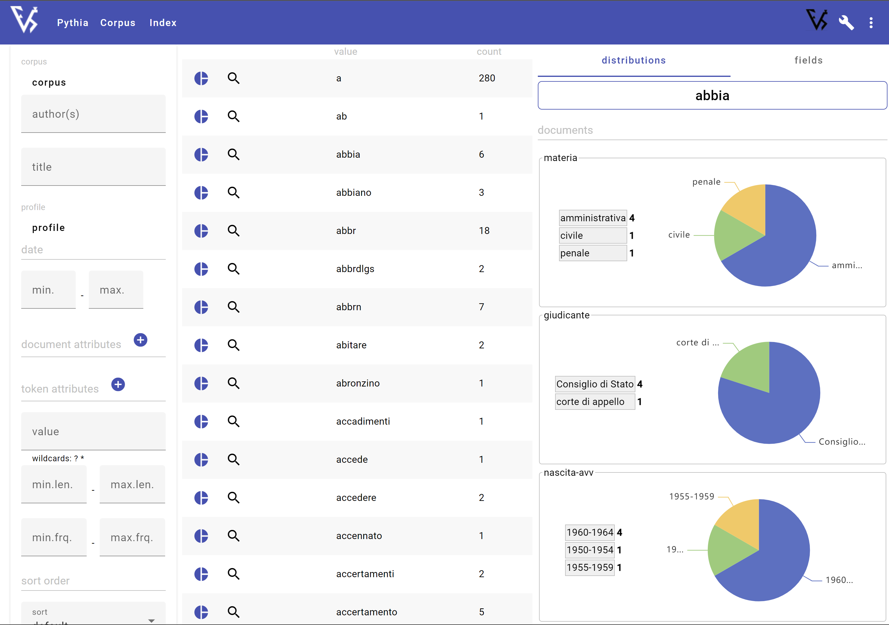
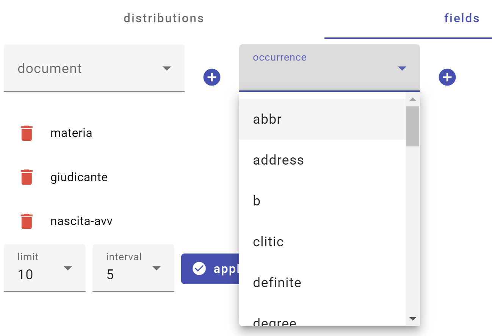

# Term List

- [Term List](#term-list)
  - [List](#list)
  - [Distribution](#distribution)
    - [Picking a Word](#picking-a-word)
    - [Grouping By Document](#grouping-by-document)
    - [Grouping By Occurrence Attribute](#grouping-by-occurrence-attribute)
    - [Ranged Values](#ranged-values)

## List

The typical Pythia shell provides a terms list, allowing users to browse all the unique terms found in the documents, each with its total count of occurrencies. This draws data from the `token` table, with the aid of an auxiliary table with tokens and their totals (`token_occurrence_count`).

This list provides a lot of filtering options to customize and reorder its contents:

- corpus: only terms in documents included in the specified corpus.
- author: only terms in documents having an author including the specified text.
- title: only terms in documents having a title including the specified text.
- source: only terms in documents having a source including the specified text.
- profile ID: only terms in documents having the specified profile ID.
- min/max date value: only terms in documents having a date value in the specified range.
- min/max time modified: only terms in documents having a last modified date in the specified range.
- document attributes: only terms in documents having any of the attributes with a value including the specified text.
- occurrence attributes: only terms having any of the attributes with a value including the specified text.
- value pattern: only terms with a value matching the specified pattern.
- min/max value length: only terms in the specified range of character lengths.
- min/max count: only terms in the specified range of frequencies.
- sort order: the desired sort order: `0`=default (by value), `1`=by value, `2`=by reversed value, `3`=by count.
- sort descending: true to sort by descending values.

## Distribution

Term list queries are used to show the distribution of a term (token) occurrences according to the values of a specified document or occurrence attribute.

The idea is allowing users to pick any of the attributes he wants to see at the right of the terms list. He can pick attributes either from documents or from occurrences.

When picking a document attribute, you want to see how the occurrences are distributed in the documents grouped by this attribute's value.

When picking an occurrence attribute, you want to see how the occurrences are distributed in the different values of this attribute.

Once he has picked 1 or more attributes and clicks on a term, he will see the first (top) N values for each of the chosen attributes, each with its frequency; plus a "other" item at the end, when values are more than N, which contains the sum of all the other frequencies.

So, say the user chooses the `giudicante` attribute from the list of available attributes. Or we just choose for him, and provide a preset list.

Now, when he clicks on a term, say `abbiano`, he will see the frequencies distributed in the different types of the `giudicante` attribute. If we have 3 occurrences of `abbiano`, and 2 of them are in documents with giudicante=`corte di appello`, while 1 is in a document with `giudicante`=`Consiglio di Stato`, we will display a list like this:

```txt
giudicante:
  - corte di appello: 2
  - Consiglio di stato: 1
```

The following picture (from the default Pythia shell) shows a sample of the terms list UI with 3 selected document attributes:



Users can inspect the desired distributions as shown in this picture:



Terms distributed by attributes with numeric values can group the values into intervals, like e.g. clusters of 5 years for birth year values. In this case, the interval can be customized, together with the limit of entries to show in each distribution.

### Picking a Word

Let's get a token to play with. To make things more interesting, let us choose a word which sometimes occurs in bold. This is the list of words with bold:

```sql
select t.id, t.value, oa.value
from "token" t 
inner join occurrence o 
on t.id = o.token_id 
inner join occurrence_attribute oa 
on o.id = oa.occurrence_id 
where oa.name='b'
order by t.value;
```

From the results we pick `affidato`:

```sql
select t.id as tid, t.value, o.id, o.document_id, o.position
from occurrence o
inner join "token" t on o.token_id=t.id
where t.value='affidato';
```

| tid | value    | id    | document_id | position |
|-----|----------|-------|-------------|----------|
| 469 | affidato | 1084  | 1           | 1084     |
| 469 | affidato | 3573  | 1           | 3573     |
| 469 | affidato | 3971  | 1           | 3971     |
| 469 | affidato | 4161  | 1           | 4161     |
| 469 | affidato | 5255  | 1           | 5255     |
| 469 | affidato | 5753  | 1           | 5753     |
| 469 | affidato | 6626  | 1           | 6626     |
| 469 | affidato | 9408  | 1           | 9408     |
| 469 | affidato | 16302 | 4           | 458      |

This word has a total of 9 occurrences, distributed in 2 documents.

### Grouping By Document

These are its occurrences by their document attribute with name='giudicante' grouped by attribute value:

```sql
-- term by doc attribute values
select distinct da.value, count(da.value) as freq
from document d
inner join document_attribute da
on d.id = da.document_id
inner join occurrence o 
on d.id = o.document_id
where da.name='giudicante' and o.token_id=469
group by da.value
order by freq desc
limit 10;
```

| value              | freq |
|--------------------|------|
| Consiglio di Stato | 8    |
| Corte di appello   | 1    |

And this would be the total when exceeding 10 rows:

```sql
-- term excess by doc attribute values
select count(da.value) as freq
from document d
inner join document_attribute da
on d.id = da.document_id
inner join occurrence o 
on d.id = o.document_id
where da.name='giudicante' and o.token_id=469;
```

Breaking things down, this is the join at the base of the above grouping:

```sql
select d.id as doc_id, da.id as da_id, da.name, da.value, o.id as o_id, o.document_id , o."position" 
from document d
inner join document_attribute da
on d.id = da.document_id
inner join occurrence o 
on d.id = o.document_id
where da.name='giudicante' and o.token_id=469;
```

| doc_id | da_id | name       | value              | o_id  | document_id | position |
|--------|-------|------------|--------------------|-------|-------------|----------|
| 1      | 83    | giudicante | Consiglio di Stato | 1084  | 1           | 1084     |
| 1      | 83    | giudicante | Consiglio di Stato | 3573  | 1           | 3573     |
| 1      | 83    | giudicante | Consiglio di Stato | 3971  | 1           | 3971     |
| 1      | 83    | giudicante | Consiglio di Stato | 4161  | 1           | 4161     |
| 1      | 83    | giudicante | Consiglio di Stato | 5255  | 1           | 5255     |
| 1      | 83    | giudicante | Consiglio di Stato | 5753  | 1           | 5753     |
| 1      | 83    | giudicante | Consiglio di Stato | 6626  | 1           | 6626     |
| 1      | 83    | giudicante | Consiglio di Stato | 9408  | 1           | 9408     |
| 4      | 115   | giudicante | Corte di appello   | 16302 | 4           | 458      |

Here we list each combination of document + document attribute + occurrence. So, if there are 8 occurrences in document 1, there are 8 rows. Should the document have more than a single `giudicante` attribute (which anyway will not happen), say 2, we would have an additional row, i.e. the document will count as 2. This is correct, as in this case the occurrence is in both the categories defined by the double document attribute.

We then group this list by value, and count the rows in each group: thus we get 8 for `Consiglio di stato` and 1 for `corte di appello`.

Ultimately, this answers the question: how are the occurrences of `affidato` distributed among documents grouped by their `giudicante` attribute?

### Grouping By Occurrence Attribute

How do our token's occurrences distribute with reference to the occurrence attribute `b` (bold)? Here is the answer:

```sql
-- term by occ attribute values
select distinct oa.value, count(oa.value) as freq
from occurrence o 
inner join occurrence_attribute oa 
on o.id = oa.occurrence_id
where oa.name='b' and o.token_id=469
group by oa.value
order by freq desc
limit 10;
```

| value | freq |
|-------|------|
| 1     | 2    |

Should there be more than 10 rows, we could get the rest from this total:

```sql
-- term excess by occ attribute values
select count(oa.value) as freq
from occurrence o 
inner join occurrence_attribute oa 
on o.id = oa.occurrence_id
where oa.name='b' and o.token_id=469;
```

But this is not the case, as we just have a single occurrence. We can just count the occurrences without `b` (this being a binary attribute, it is just absent when false):

```sql
select count(o.id) as tot
from occurrence o 
where o.token_id=469;
```

which gives 9; thus 9-2=7 is the count of occurrences without bold.

### Ranged Values

When the chosen attribute is numeric, you specify ranges for its values. For instance:

```sql
-- term by ranged doc attribute values (here range=5)
select distinct concat(
 cast(cast(da.value as int) / 5 * 5 as varchar),
 '-',
 cast(cast(da.value as int) / 5 * 5 + 4 as varchar)
),
count(da.value) as freq
from document d
inner join document_attribute da on d.id = da.document_id
inner join occurrence o on d.id = o.document_id
where da.name='nascita-avv' and o.token_id=10
group by cast(da.value as int) / 5
order by freq desc
limit 10
```

```sql
-- term by ranged occ attribute values
select distinct concat(
 cast(cast(oa.value as int) / 5 * 5 as varchar),
 '-',
 cast(cast(oa.value as int) / 5 * 5 + 4 as varchar)
),
count(oa.value) as freq
from occurrence o 
inner join occurrence_attribute oa 
on o.id = oa.occurrence_id
where oa.name='len' and o.token_id=10
group by cast(oa.value as int) / 5
order by freq desc
limit 10;
```
