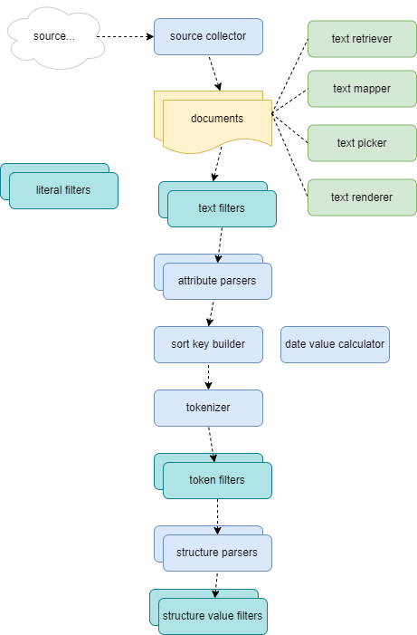

# UDP Integration

A couple of plugins are provided for a quick integration of [UDPipe](https://lindat.mff.cuni.cz/services/udpipe/) POS taggers into the analysis system.

The main issue in integrating POS taggers into the complex Pythia [analysis flow](analysis.md) is that Pythia remains agnostic with respect to the input text format, and most times it analyzes marked text (e.g. XML) rather than plain text. Also, its flow is fully customizable, so your own tokenization algorithm might well be different from that adopted by the chosen UDPipe model.

As a recap, the figure below shows the Pythia's analysis components in their flow:

To solve these issues while still being compliant with its open and modular architecture, Pythia provides a couple of plugins designed to work together: the [UDP text filter](components.md#udp-text-filter) and the [UDP token filter](components.md#udp-token-filter).

The [UDP text filter](components.md#udp-text-filter) belongs to the family of text filters components, i.e. it's a filter applied once to the whole document, at the beginning of the analysis process. The purpose of this filter is not changing the document's text, but only submitting it to the UDPipe service, in order to get back POS tags for its content.

This submission may either happen at once, when text documents have a reasonable size; or may be configured to happen in chunks, so that POST requests to the UDPipe service have a smaller body. In this case, the text filter is designed in such a way to avoid splitting a sentence into different chunks (unless it happens to be longer than the maximum allowed chunk size, as configured in the profile).

Whatever the submission details, in the end this filter collects all the POS tags for the document's content. So, it's just a middleware component inserted at the beginning of the analysis flow, after some filters like the [XML filler filter](components.md#xml-tag-filler-text-filter) have been applied to 'neutralize' eventual markup (which of course must be excluded from UDPipe processing).

Later on, after the text has been tokenized, the [UDP token filter](components.md#udp-token-filter) comes into play. Its task is matching the token being filtered with the token (if any) defined by UDPipe, extract all the POS data from it, and store into the target index the subset of them specified by the analysis configuration.

Token matching happens in a rather mechanical way: as the filter has the character-based offset of the token being processed and its length, it just scans the POS data got by the UDP text filter and matches the first UDPipe token overlapping it. This is made possible by the fact that the text filter requested the POS data together with the offsets and extent of each token (passed via the CONLLU `Misc` field). So, whatever the original format of the document and the differences in tokenization, in most cases this produces the expected result and thus provides a quick way of incorporating UDPipe data in the index.
